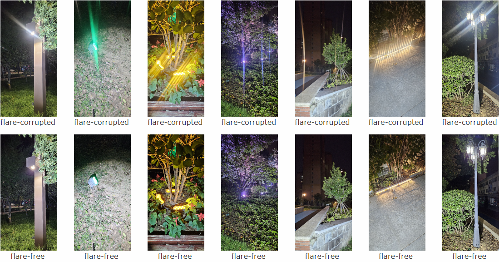

# FlareReal600: A Real Paired Nighttime Flare Removal Dataset





### FlareReal600
**FlareReal600**, the first real paired nighttime flare removal dataset, consists of 600 real-paired flare images with 2k resolution.

### Update

- **2024.01.15**: We released the training codes and our FlareReal600 dataset (2k resolution).

### Installation

1. Clone the repo

    ```bash
    git clone https://github.com/Zdafeng/FlareReal600.git
    ```

1. Install dependent packages

    ```bash
    cd FlareReal600
    pip install -r requirements.txt
    ```

1. Install FlareReal600<br>
    Please run the following commands in the **FlareReal600 root path** to install FlareReal600:<br>

    ```bash
    python setup.py develop
    ```

### Data Download

|     | Baidu Netdisk | Google Drive | Number | Description|
| :--- | :--: | :----: | :---- | ---- |
| FlareReal600(train) | [link](https://pan.baidu.com/s/1-HyzbaknaTC5y2NXVK1uFw?pwd=mipi) | [link](https://drive.google.com/drive/folders/1LLLYEM0RhQMWIj0lTl_rK3jzZJWJrd5m?usp=sharing) | 600 | FlareReal600 training dataset contains 600 real aligned training images in 2k resolution. |
| FlareReal600(val)| [link](https://pan.baidu.com/s/1L8hc_H_kNrNOX4ArL-DEtA?pwd=mipi) | [link](https://drive.google.com/drive/folders/1NcyicOR1LuGd4HygelLcxC2e0Y_-_L9q?usp=sharing) | 50 | FlareReal600 validation dataset contains 50 real aligned training images in 2k resolution.|

### Inference Code
To estimate the flare-free images with trained model, you can run the `test.py` by using:
```
python test.py --input dataset/input --output result/ --model_path experiments/net_g_last.pth
```

### Evaluation Code
To calculate different metrics with trained model, you can run the `evaluate.py` by using:
```
python evaluate.py --input result/ --gt dataset/gt/
```

### Training model

**Training with single GPU**

To train a model with FlareReal600 dataset, you can edit the `options/uformer_paired_baseline_option.yml` and run the following codes. 

```
python basicsr/train.py -opt options/uformer_paired_baseline_option.yml
```
If you want to use Flare7K++ as additional dataset for training, please use:
```
python basicsr/train.py -opt options/uformer_paired_flare7kpp_baseline_option.yml
```

**Training with multiple GPU**

You can run the following command for the multiple GPU tranining:

```
CUDA_VISIBLE_DEVICES=0,1 bash scripts/dist_train.sh 2 options/uformer_paired_baseline_option.yml
```
If you want to use Flare7K++ as additional dataset for training, please use:
```
CUDA_VISIBLE_DEVICES=0,1 bash scripts/dist_train.sh 2 options/uformer_paired_flare7kpp_baseline_option.yml
```

### Contact
If you have any question, please feel free to reach me out at `dfeng.zhang@samsung.com`.

### Acknowledgement
This project is mainly based on [Flare7K](https://github.com/ykdai/Flare7K).